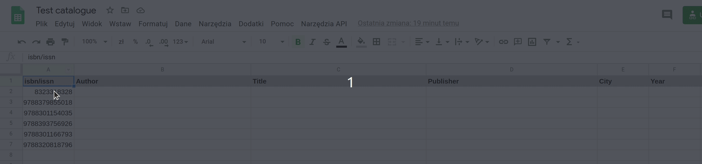

# Google Sheets Book Catalogue

I made this script some time ago to automate book cataloguing. This is very much work in progress but the basics work as intended.

## How to use

1. Write ISBN codes in the first column of the sheet.
2. Select them.
3. From "Narzędzia API" menu (yes, it's in Polish right now) select the only available option.
4. Wait until data are filled based on Polish National Library records.

## Demo

